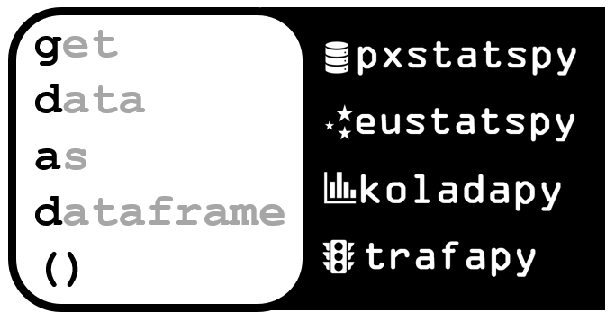

# 👋 Hi, I'm xemarap!

## 👨‍💻 About Me
I'm a Data Scientist passionate about making data and data science more accessible through open-source tools and well-documented solutions.

## 🛠️ Tech Stack
**Languages:** Python (primary) • R (proficient)  
**Data Science:** Pandas • NumPy • Scikit-learn • Matplotlib/Seaborn • Jupyter  
**AI/ML:** LangChain • HuggingFace • OpenAI API • Anthropic API • Pydantic  
**Databases:** ChromaDB  

## 🚀 Featured Projects

<picture align="center">
  <source media="(prefers-color-scheme: dark)" srcset="gdad_dark.png">
  
</picture>

My `get_data_as_dataframe()` project aims to vastly simplify how data scientists, data engineers, analysts, statisticians and users can use publicly available API's to download open data directly to their environments and start analyzing the data immediately. That's why my featured Python API wrappers comes down to using the `get_data_as_dataframe()` function for retrieving the data as a dataframe.

### [pxstatspy](https://github.com/xemarap/pxstatspy)
Streamline access to Swedish statistical data with this Python wrapper for Statistics Sweden's PxWebAPI 2.0. Makes complex government datasets simple to work with.

### [eustatspy](https://github.com/xemarap/eustatspy)
A Python wrapper for the Eurostat statistics and catalogue APIs, providing easy access to European statistical data.

### [koladapy](https://github.com/xemarap/koladapy)  
Unlock Swedish municipality insights with easy API access. Perfect for researchers and analysts working with local government data.

### [trafapy](https://github.com/xemarap/trafapy)  
A comprehensive Python package for accessing and analyzing Swedish transport statistics through the Trafikanalys API.

## ✨ What You'll Find Here
📊 **Data-driven solutions** for real-world problems  
🔧 **Well-documented tools** that save time for fellow data scientists  
🤝 **Collaborative projects** - I actively welcome issues, PRs, and discussions  
📚 **Learning resources** and examples from my data science journey

## 📫 Let's Connect
- 💬 Open an issue or start a discussion in any repository
- 🐙 Follow me on [GitHub](https://github.com/xemarap) for updates
- 💼 Connect with me on [LinkedIn](https://www.linkedin.com/in/emanuelraptis/)

*Always open to collaboration and feedback!*

---
Thanks for stopping by!
